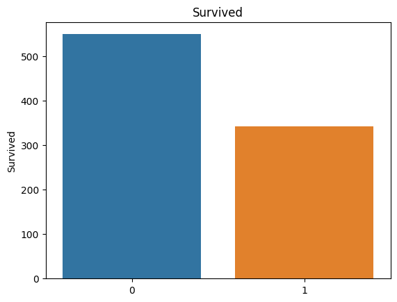
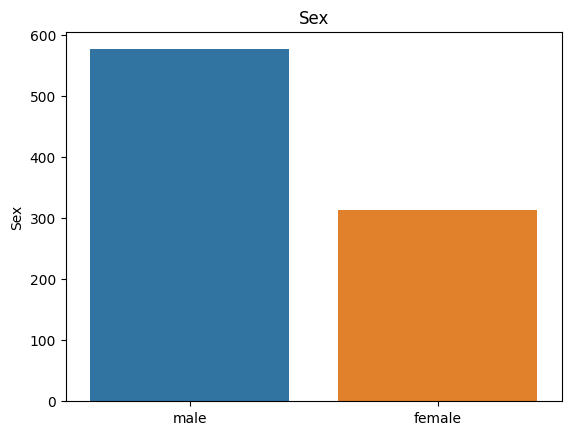

# NNforTitanic

## Abstract
This project willl explore the efficacy of a neural network approach to Kaggle's Titanic dataset competition by comparing evaluation metrics with other machine learning techniques.

## Problem
The rows in our dataset represent indiviuals who embarked on the Titanic's maiden voyage in 1912. The columns represent particular details about each individual (ie, name, age, ticket class). The dependant variable we wish to predict is whether or not a given passenger survived the voyage, or died during the disaster. Hence, this is a binary classification problem.

## Method 
To establish a baseline, Sci-kit Learn models `RandomForestClassifier`, `LogisticRegression` and `GaussianNB` are used. For a baseline, the highest accuracy score acquired with `GridSearchCV` is used. We then rank these scores into a table; and, once trained, we can acquire a validation score for our neural netowrk approach, and subsequently see where it lands on the scoreboard. 

The neural network is a feedforward network consisting of one hidden layer of 50 hidden units and a ReLU activation, followed a by an output layer of one sigmoid unit. Predictions are taken on a threshold basis, ie for outputs lower than 0.5, we predict 0 (died); and for ouputs higher we predict 1 (survived). The final architecture for this network was determined through trial and error experiments. For training, binary cross-entropy was used as a loss function, and the Adam optimiser was used with a learning rate of 0.00005 and weight decay of 0.002. These hyper-parameters were also selected through experiments.

## Results

## The data
The data consists of the following columns, including the top 5 rows so as to exemplify the value formats:

Here, `ParCh` indicates the number of parents/children that accompanied the passenger. `SibSp` indicates the number of sibllings/spouses. `Embarked` refers to which port the passenger embarked on. The `Pclass` column represents ticket classes, ie "first class", "second class" and "third class".

Below shows the data types of the columns, and the number of entries for that column. What we see is that `Age` and `Cabin` have some missing values:

Below gives a discription of numerical data in the dataframe:

The mean average for the `Survived` feature is 0.38. Given this is a binary value, with 1 indicating survival, we can infer a 38% chance of survival for passengers in the training set. Collumns such as `Age` and `Fare` have a high standard deviation, which suggests they may need to be normalised. We can also see that 75% of passengers paid less than $31, despite the mean being $32.20 - this is because of extremely high values, such as the maximum ticket fare of $512.33. This further suggests this column can be normalised.

Below are histograms for some numerical values. The `Age` column shows a fairly normal distribution, but the others do not, indicating that some feature engineering maybe of use to normalise them.

For non-numerical values, we can get counts of appearances of a given value. For example, with the `Embarked` column we can the number of passengers who embarked at each of the locations, and represent this distribution with a box plot. Some non-numerical types do not represent categories; for example, `Name` and `Cabin` have unique values, and therefore have not been illustrated below.

The locations corresponding the embarking categories are `S = Southampton`, `Q = Queensland` & `C = Cherbourg`.

At this stage we should understand more about the structure and shape of the training dataset. To take this understanding further, we can examine the relationships between the different properties of the samples; we are particularly interested in the independant variables' relationships to the `Survived` property.

Below is a heatmap that illustrates the correlation between each property. Using the legend on the right, squares closer to one (light) have a higher positive correlation, whilst squares closer to -0.5 (dark) have a higher negative correlation. A zero indicates no relationship. In order to include the `Sex` column, we changed `female = 1` and `male = 0`.

According to the heatmap, there is a significant negative correlation between ticket class and survival; this shows that being in first class (denoted by a value of 1) makes a passenger more likely to survive than one in third class (denoted by a value of 3). We can also observe a positive correlation between the cost of the ticket and the survival rate, though this may be a mirror of the pattern observed between `Pclass` and `Survived`. We also see that females have a higher chance of surviving than males.

If we take a pivot table of the numerical data, we can see the average values of those who survived and those who died:

The average ticket price of survivors is far higher than that of non-survivors, which indicates that `Fare` is a particularly important column for our purposes. Similarly, we can see that there is potential value in modelling the `Parch` and `SibSp` columns.

For categorical data, we can use value counts to illustrate how many of each category survived and how many did not.

For the `Embarked` column, we can see passengers embarking from Cherbourg have a higher survival rate than those from Southhampton, with Queensland falling in between. We see from the `Sex` column that vast majority of females survived whilst the vast majority of males did not, meaning that this data maybe particularly important for our prediction model. We also see the correlation between ticket class and survival illustrated again, suggesting that this also is an important feature for our model.

Finally, we can explore the `Cabin` column. The given values for this column are not useful as the Cabin IDs are unique. However, some passenger have access to multiple cabins under their name. Below is a pivot table generated on the number of cabins under a passengers name:

In addition, we can take the first letter of the cabin to bbe a given category (where `n` indicates null value):

Both of these tables indicate that there may be relevent information in the distribution of passengers into these categories.

## Data processing

## References & resources
